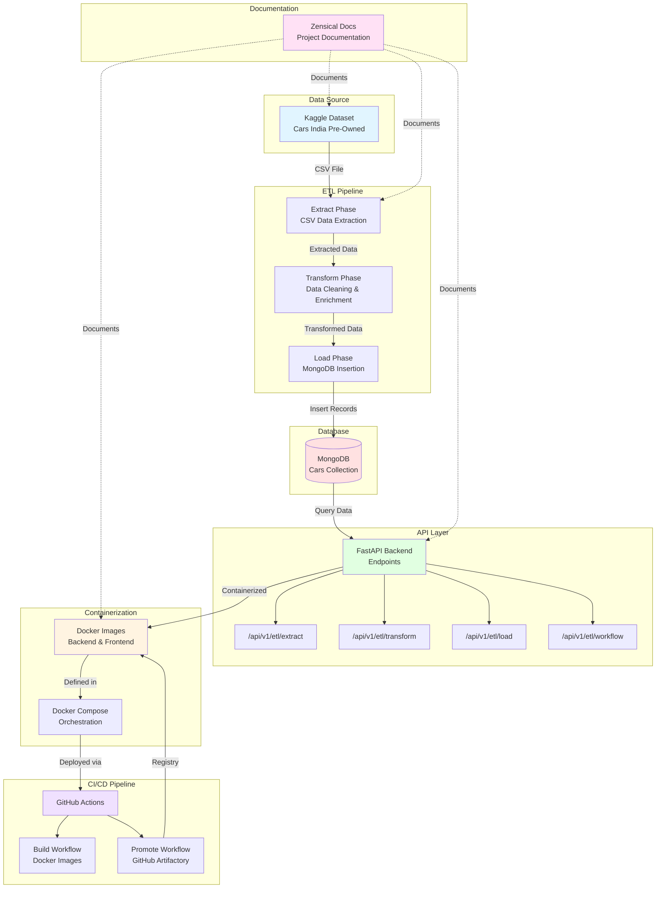

# :lucide-diamond: Introduction

This project was made by Roméo AGOSTINO, Théo BIGAND, Moussa DRAME & Mathieu AUDIBERT for a [ESILV project](https://www.esilv.fr/).



## Technical stack :lucide-braces:

* Python :simple-python:
* MongoDB :simple-mongodb:
* Docker :simple-docker:
* K8S :simple-kubernetes:
* Git/GitHub :simple-git:
* Github Actions :simple-githubactions:
* Zensical 

---

## Doc Plan :lucide-drafting-compass:

| Link                                    | Description                          |
| --------------------------------------- | ------------------------------------ |
| 1. **[Context](./context.md)**          | The context of this project          |
| 2. **[Objectives](./objectives.md)**    | The objectives of this project       |
| 3. **[Tasks](./tasks.md)**              | Our tasks w/ our current progression |
| 4. **[Optionnal tasks](./opt-task.md)** | Optionnal tasks w/ our progression   |
| 5. **[Links](./link.md)**               | All the important links              |
| 6. **[Useful commands](./usfl-cmd.md)** | List of useful commands              |

---

## Get Started :lucide-arrow-up-right: 

!!! info
    
    Python is required to run this project.

Clone the repo :

``` bash 
git clone https://github.com/MathieuAudibert/Conteneurisation-Orchestration.git
```

Then, setup your virtual env :

=== "Python :simple-python: / Windows :fontawesome-brands-windows:"

    ``` cmd
    python -m venv venv
    venv\Scripts\activate
    
    ```

=== "Python :simple-python: / MacOS :simple-apple:/Linux :simple-linux:"

    ``` bash
    python -m venv venv
    source venv/bin/activate
    ```

=== "Uv :simple-uv:"

    ``` bash
    uv init 
    ```

Once you've installed and setted your virtual env, you can install the necessary dependancies w/ [pip](https://pypi.org/project/pip/) or [uv](https://docs.astral.sh/uv/).

=== "pip :simple-pypi:"

    ``` bash
    pip install -e .
    ```

=== "uv :simple-uv:"

    ``` bash
    uv pip install -e .
    ```

You're all done now !